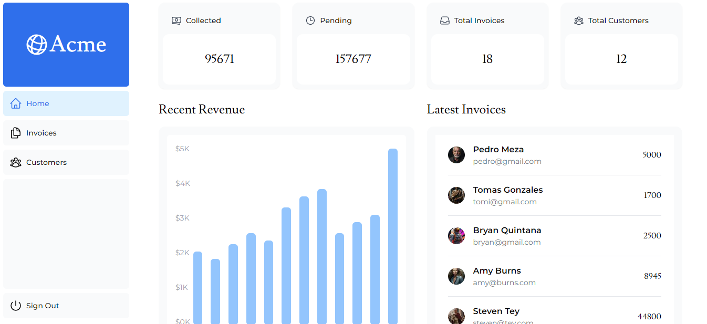

# CollectionX 📊💰

CollectionX is a debt management application designed to help you efficiently manage your debt collection processes.

## Features 🚀

- **Client Management**: Record and manage client information, including contact details and payment history.
- **Debt Tracking**: Keep track of outstanding debts and payments.
- **Intuitive Interface**: User-friendly interface for easy navigation.

## Preview 🖼️

## Live Demo 🌐

Access the live demo [here](https://collectionx.vercel.app/)!

## Support 📧

For help or to report issues, please open an issue in this repository.
